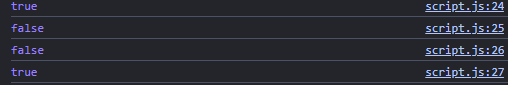
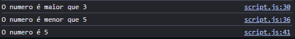
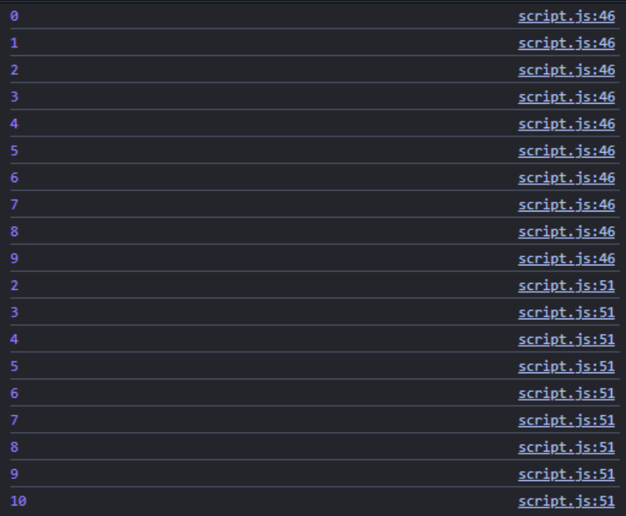

# 1: O que e JavaScript.

JavaScript e uma linguagem de programacao que permite a voce implementar itens complexos em paginas web toda vez que uma pagina da web faz mais do que simplesmente mostrar a voce informacao estatica mostrando conteudo que se atualiza em um intervalo de tempo, mapas interativos ou graficos 2D/3D animados, etc.

# Para que o JavaScript serve.

E a terceira camada do bolo das tecnologias padroes da web, duas das quais (HTML e CSS) O JavaScript serve como linguagem para programacao que permite a voce criar conteudo que se atualiza dinamicamente, controlar multimidias, imagens animadas

# Como ele complementa HTML e CSS?

Ele complementa o CSS e o HTML com interatividade e dinamismo as paginas web. Ele e uma linguagem de programacao poderosa usada para controlar o comportamento de elementos em tempo real.

# 2: JavaScript escrito dentro da propria pagina HTML.

Você escreve o código dentro da propria página, entre as tags .
Vantagem: e rápido de fazer para testes simples.
Desvantagem: Se o código for grande, o arquivo HTML vira uma bagunca.

# JavaScript em arquivo separado (script.js).

Você cria um arquivo so para o código (ex: script.js) e avisa o HTML que ele deve usar esse arquivo: 
Vantagem: Deixa tudo organizado e você pode usar o mesmo arquivo em varias paginas do site.
Desvantagem: Voce precisa gerenciar dois arquivos em vez de um.

# 3 Variaveis, tipos e escopo

# O que e uma variavel:

É um espaço onde guardamos um valor (número, texto, etc.) para usar no código.

# Como declarar variavel em JavaScript:

Para declararmos a Variavel nos usamos var, let ou const.

# Diferenca entre var, let e const:

Agora a diferenca entre var, let , e const.
var: Antiga, pode mudar e aparece fora de blocos.
let: Pode mudar, mas só funciona dentro do bloco.
const: Não pode mudar

# Quando cada uma pode ser usada:

Quando que a gente pode usar essas variaveis:
var Evite usar
let Quando o valor mudar
const Quando o valor nao mudar

# O que é escopo global:

Variáveis de escopo global pode ser usada em qualquer lugar do código.
Isso pode parecer útil, mas também é perigoso. Elas podem causar confusão, conflitos com outras variáveis e deixar o código mais difícil de entender e manter.
Não é que você não possa usar, mas é importante ter cuidado e saber exatamente o que está fazendo, já que essas variáveis ficam “soltas” e visíveis em qualquer lugar do sistema.

# O que é escopo de função:

Só funciona dentro da função.
Na maioria das vezes, isso acontece dentro de funções ou seja, a variável só existe ali dentro e não pode ser acessada fora.
Isso ajuda a evitar confusão, já que cada parte do código usa suas próprias variáveis sem interferir nas outras.

# O que é escopo de bloco:

Só funciona dentro de { } (if, for, etc).
Isso significa que ela só funciona naquele pedaço específico do código, ajudando a deixar tudo mais organizado e evitando conflitos com outras variáveis.

{ var nome ="Henrique"; }

console.log(nome); //Aqui vai mostrar normal pq a variavel ela pode ser global ou não

{ let idade = 17; }

console.log(idade); //Aqui vai dar erro porque é local, então só iria funcionar se tivesse dentro do bloco

{ const PI = 3.14; }

console.log(PI); //Vai falar que não foi definida porque a variavel PI só existo dentro do bloco 

# 4: Operadores, comparações e lógica  |  Operadores aritméticos principais

Os operadores aritméticos trabalham em constantes numéricas válidas ou em variáveis que representam constantes numéricas válidas

+ : Somar
- : Subtrair
* : Multiplicar
/ : Dividir

Diferença entre == e ===: == (igualdade solta): Compara apenas o valor, fazendo conversão automática de tipo (type coercion). === (igualdade estrita): Compara valoretipo de dado. Recomendado! Ex: console.log(5 == "5"); // true → converte string para número console.log(5 === "5"); // false → tipos diferentes (number vs string)

console.log(0 == false); // true console.log(0 === false); // false

console.log(null == undefined); // true console.log(null === undefined); // false

Diferença entre != e !==: != → Diferente (com conversão de tipo) !== → Diferente estrito (valor e tipo) Ex: console.log(5 != "5"); // false → porque 5 == "5" é true console.log(5 !== "5"); // true → tipos diferentes

# Exemplos:

Console.log(numero == "5") //Vai dar true mesmo o numero sendo int e o valor comparado sendo string porque o programa entende que os dois são o mesmo valor independente do tipo da variavel console.log(numero === "5") //Vai dar false porque o valor pode ser o mesmo mas a variavel é diferente console.log(numero != "5") //Vai dar false porque ele entende que o valor não é diferente console.log(numero !== "5") //Vai dar true porque ele entende que o valor é diferente É melhor usar === porque ele vai verificar se o resultado é realmente igual verificando a variavel e outro atributos.

# 5. Estruturas condicionais

if: É uma estrutura de controle de fluxo fundamental que executa um bloco de código somente se uma condição especificada for verdadeira (true).

if...else: É uma estrutura de controle de fluxo fundamental usada para tomar decisões. Ele avalia uma condição booleana: se for verdadeira (true), executa um bloco de código; se falsa (false), executa outro bloco (else) ou segue adiante.

switch: O switch é uma estrutura de controle condicional usada no Java e JavaScript para selecionar e executar um bloco de código entre várias opções (cases).

# 6. Estruturas de repetição

O que é: Servem para rodar o mesmo código várias vezes sem precisar escrever a mesma linha repetidamente.

while: Usamos o while (que significa "enquanto") quando não sabemos ao certo quantas vezes vai repetir, apenas que deve continuar enquanto uma condição for verdadeira.

for: Usamos o for quando sabemos exatamente quantas vezes queremos repetir algo (ex: contar de 1 a 5).

# Exemplo

for(var i = 0; i < 10; i++){ console.log(i) } var valor = 1; while(valor < 10 ){ valor++; console.log(valor)};

# 7: Funções

O que é uma função: A função é basicamente um bloco de código que fica guardado e só "trabalha" quando você o chama. Serve para você não ter que repetir o mesmo código várias vezes.

como declarar uma função: function nome([parametro]) { instruções }

como chamar uma função: nome()

função com parâmetro: function idadePessoa(idade){

} Ela precisa da varivel idade para funcionar

função com retorno: function soma(a,b){ return a + b; } Ela vai fazer o retorno dos valores da soma das variaveis a e b

# Exemplos:

function ola(){ console.log("Olá mundo"); } ola();

function olaNome(nome){ console.log("Olá, " + nome); } olaNome("Henrique");

function soma(a,b){ return a + b; } let resultado = soma(5, 3); console.log(resultado)

# 8: Manipulação de página com JavaScript

O document.getElementById é a nossa ponte entre o HTML e o JavaScript. Através dele, 'fisgamos' um elemento específico pelo seu ID para manipulá-lo. Já a propriedade textContent é a ferramenta de ação: ela nos permite acessar e alterar o texto desse elemento instantaneamente, transformando o conteúdo estático em algo totalmente interativo. 
id="titulo"> Olá aqui eu setei o Óla com o Id titulo =document.getElementById("titulo").textContent = "Alterou"; Ai aqui no JavaScript eu peguei  esse id titulo e alterei o Texto Olá por meio do textContent para Alterou 

O querySelector funciona de forma semelhante ao getElementById, mas com um diferencial poderoso: ele é versátil. Enquanto o primeiro busca apenas IDs, o querySelector utiliza seletores CSS para encontrar qualquer elemento — seja por classe (.), ID (#) ou tag. É a ferramenta ideal para capturar e manipular componentes de forma precisa e dinâmica diretamente no JavaScript

A propriedade .value é o que nos permite ler ou injetar dados em campos de formulário. Enquanto o textContent mexe com textos fixos, o .value interage diretamente com o que o usuário digita ou com o que o sistema define para um input. Ao atribuir uma variável ao .value, o JavaScript atualiza o campo em tempo real, tornando o preenchimento de dados automatizado e dinâmico
Variável nomeUsuariario que é Henrique  Ficando assim

A propriedade .checked funciona como um interruptor lógico para inputs do tipo checkbox ou radio. Em vez de capturar um texto, ela nos entrega um valor booleano: true se a caixa estiver marcada e false se estiver vazia. É o recurso essencial para validar escolhas do usuário e disparar ações condicionais de forma automática no sistema.
if(checkbox.checked){console.log("A caixa foi clicada")}els{console.log("A caixa nao foi clicada")} 

O .style: Aplica estilos CSS diretamente em um elemento específico através do JavaScript; 

O .classList: Manipula as classes de um elemento, permitindo ligar ou desligar estilos já definidos no CSS;

addEventListener(): Funciona como um sensor de eventos, disparando uma ação sempre que o usuário interagir com o elemento (ex: um clique).

# 9: Referências

https://developer.mozilla.org/pt-BR/docs/Learn_web_development/Core/Scripting/What_is_JavaScript 

https://www.devmedia.com.br/html-basico-codigos-html/16596 

https://www.dio.me/articles/a-sinergia-entre-html-css-e-javascript

https://www.w3schools.com/js/js_variables.asp

https://www.treinaweb.com.br/blog/operadores-de-comparacao-na-programacao 

https://www.ic.unicamp.br/~wainer/cursos/2s2011/Cap06-RepeticaoControle-texto.pdf 

https://www.todamateria.com.br/funcao/ 

https://www.freecodecamp.org/news/dom-manipulation-in-javascript/ 